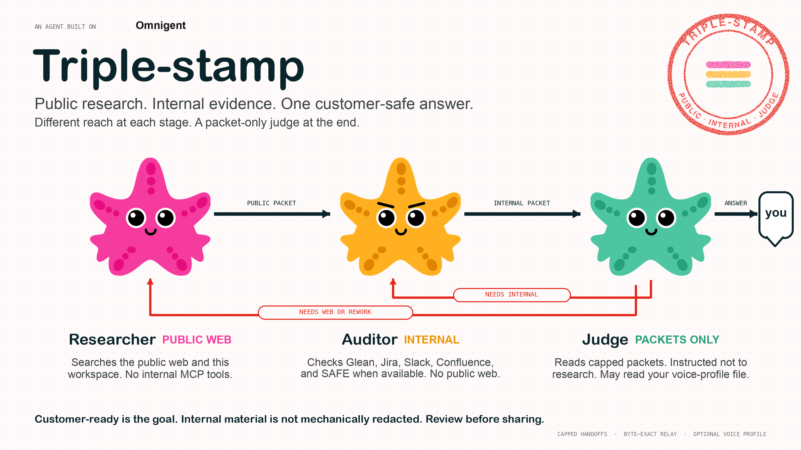

<p align="center">
  
</p>

<h3 align="center">Public research. Internal evidence. One customer-safe answer.</h3>

<p align="center">
  Public web and workspace evidence first. Internal systems if you have them. Then a packet judge writes the answer.<br>
  Add a saved voice profile and Codex can make it sound like you, then re-check the claims against the packets.
</p>

<br>

<table align="center" width="100%">
  <tr>
    <td align="center" width="33%"></td>
    <td align="center" width="33%"></td>
    <td align="center" width="33%"></td>
  </tr>
  <tr>
    <td align="center"><b>Cursor</b></td>
    <td align="center"><b>Opus</b></td>
    <td align="center"><b>Codex</b></td>
  </tr>
  <tr>
    <td align="center">Researches the public web and this workspace.</td>
    <td align="center">Attempts Glean, Jira, Slack, Confluence, and SAFE.</td>
    <td align="center">Judges capped packets, then writes.</td>
  </tr>
  <tr>
    <td align="center"><sub>No internal MCP tools.</sub></td>
    <td align="center"><sub>No web access.</sub></td>
    <td align="center"><sub>Instructed not to research; may read your voice-profile file.</sub></td>
  </tr>
</table>

<br>

<p align="center">
  Cursor gathers public and workspace evidence. Opus checks the internal systems it can reach.<br>
  Codex is instructed to judge those handoffs, not start its own research. Triple-stamp relays its final answer byte for byte.
</p>

> **Read it before you send it.** Triple-stamp writes one answer and tries to keep it customer-ready, but it does not split the answer into a customer half and an internal half, and it does not strip internal details out for you. Whatever the judge writes is what you get, word for word. Give it a quick read before you forward it.

---

## Install

```bash
uv tool install omnigent==0.12.0   # once
cursor-agent login                 # once
./triple-stamp                     # every time
```

> **Reference implementation.** It expects Databricks-internal infrastructure: the package proxy, Opus's Glean, Jira, Slack, Confluence, and SAFE access, and a Cursor account entitled to Grok 4.6 Extra High. Outside that environment the install will not finish. The full design stays readable in `config.yaml` and `agents/*/config.yaml`.

## Use

```bash
./triple-stamp
```

This is the only command you run. It opens the same run in two places:

- a **browser URL** printed to your terminal, and
- the **interactive terminal** prompt.

Ask your question in either one. Type `/quit` to stop the run and clean up.

<sub>A real run takes about 15 minutes to an hour. Opus's internal audit is slow on purpose. Each stage prints as it starts.</sub>

## Make it sound like you

The answer does not have to sound like generic AI prose. Triple-stamp can render it in your saved voice profile: your cadence, level of detail, and preferred phrasing.

```bash
export TRIPLE_STAMP_VOICE_PROFILE="$HOME/path/to/your-voice-profile.md"
./triple-stamp
```

Set the variable to an absolute path to a non-empty UTF-8 Markdown file. Codex reads that exact file on every run. Leave the variable unset for plain professional prose.

The profile changes how the supported answer is written, not what counts as evidence. Codex re-checks the wording against the packets before it can stamp the answer.

Use [`tests/fixtures/example-voice-profile.md`](tests/fixtures/example-voice-profile.md) as a starting point.

## Without Glean

You do not need Glean to run Triple-stamp. Opus still tries every internal system it knows about: Glean, Jira, Slack, Confluence, and SAFE.

There is one catch, and it is on purpose. If a question needs internal evidence and Glean is set up but never answers, the run ends unstamped instead of guessing. You still get the best answer the evidence supports, with the missing pieces named, but it does not carry the stamp.

<br>

<p align="center">
  
</p>

<p align="center">
  <sub>
    answer relayed byte for byte
    &nbsp;·&nbsp; optional saved voice via <code>TRIPLE_STAMP_VOICE_PROFILE</code>
    &nbsp;·&nbsp; <code>./triple-stamp --self-test</code> checks the install without starting a research run
    &nbsp;·&nbsp; macOS only
  </sub>
</p>
