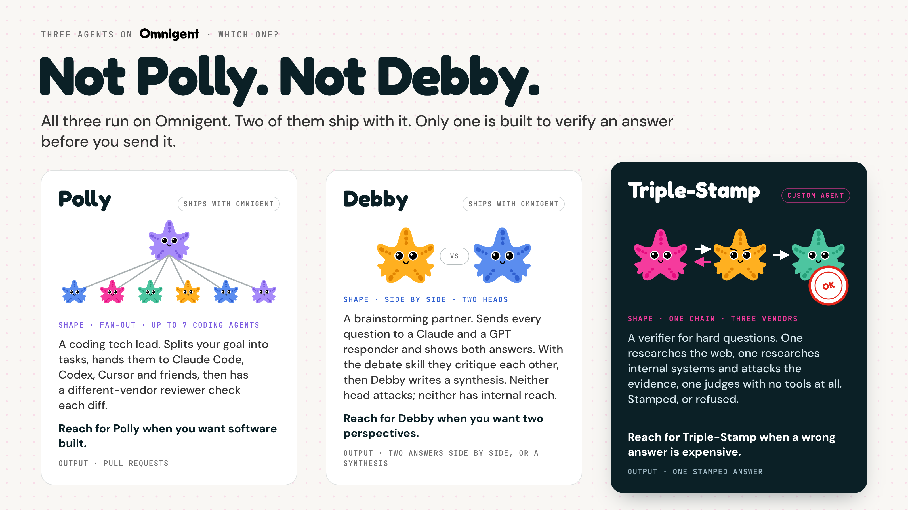

<p align="center">
  
</p>

<h1 align="center">Triple-stamp</h1>

<p align="center">
  <b>Three independent models, from three different companies, review every answer.</b><br>
  Only the one that survives all three ever reaches you.
</p>

---

## What it is

Three agents look at your question with deliberately different reach — and only the last one is allowed to talk to you.

<table align="center">
<tr>
  <td align="center" width="220"></td>
  <td align="center" width="220"></td>
  <td align="center" width="220"></td>
</tr>
<tr>
  <td align="center"><b>Cursor</b><br><sub>Grok&nbsp;4.6&nbsp;Extra&nbsp;High</sub></td>
  <td align="center"><b>Opus</b><br><sub>Claude&nbsp;Opus</sub></td>
  <td align="center"><b>Codex</b><br><sub>GPT‑5.6&nbsp;Sol</sub></td>
</tr>
<tr>
  <td align="center"><b>Researches the public web.</b><br>Cannot see internal systems.</td>
  <td align="center"><b>Audits that evidence against internal systems.</b><br>Cannot browse the web.</td>
  <td align="center"><b>Judges whether it holds up, then writes the answer.</b><br>Does no research of its own.</td>
</tr>
</table>

Because the two researchers can't see each other's sources, neither can quietly cover for the other. The final answer is relayed **byte-for-byte** from Codex's stamp — so you either get an answer that passed all three stages, or an explicit failure. Never a guess dressed up as an answer.

## Install

```bash
uv tool install omnigent==0.12.0   # once
cursor-agent login                 # once
./triple-stamp                     # every time
```

> **Reference implementation.** It expects Databricks-internal infrastructure — the package proxy, Opus's Glean / Jira / Slack / Confluence / SAFE access, and a Cursor account entitled to Grok 4.6 Extra High. Outside that environment the install won't complete, but the whole design is readable here: `config.yaml` is the routing contract and `agents/*/config.yaml` are the three worker prompts.

## Use

```bash
./triple-stamp
```

That's the only command you run. It opens **two surfaces onto the same run**:

- a **browser URL** it prints to your terminal, and
- the **interactive terminal** prompt itself.

Ask your question in either one. Type `/quit` in the terminal to stop the run and clean up. A real run takes roughly 15 minutes to an hour — Opus's internal audit is genuinely slow — and each stage narrates as it starts, so you can tell it's working.

<p align="center">
  
</p>

<p align="center">
  <sub>
    Two review rounds by default, four in deep mode (<code>TRIPLE_STAMP_MAX_CYCLES=4</code>) · hard <b>$50</b> budget cap · answer relayed byte-for-byte from Codex's stamp · optional final-answer voice via <code>TRIPLE_STAMP_VOICE_PROFILE</code> · <code>./triple-stamp --self-test</code> runs the full regression suite with no models and costs nothing · macOS only.
  </sub>
</p>

<p align="center">
  
</p>
