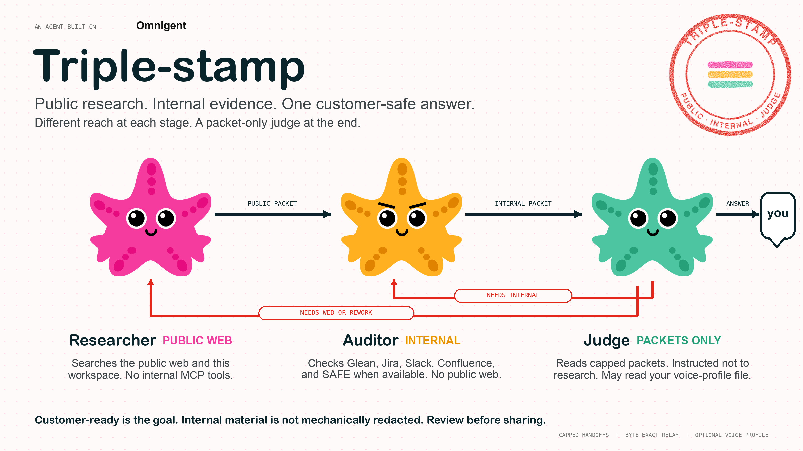

<p align="center">
  
</p>

<h3 align="center">Public research. Internal evidence. One customer-safe answer.</h3>

<p align="center">
  Public web and workspace evidence first. Internal systems if you have them. Then a packet judge writes the answer.<br>
  Add a saved voice profile and Codex can make it sound like you, then re-check the claims against the packets.
</p>

<p align="center"><sub><b>v1.2.5</b> · <a href="CHANGELOG.md">What's new</a></sub></p>

<br>

<table align="center" width="100%">
  <tr>
    <td align="center" width="33%"></td>
    <td align="center" width="33%"></td>
    <td align="center" width="33%"></td>
  </tr>
  <tr>
    <td align="center"><b>Cursor</b></td>
    <td align="center"><b>Opus</b></td>
    <td align="center"><b>Codex</b></td>
  </tr>
  <tr>
    <td align="center">Researches the public web and this workspace.</td>
    <td align="center">Attempts Glean (including Salesforce records), Jira, Slack, Confluence, and SAFE, plus account usage from an add-on.</td>
    <td align="center">Judges capped packets, then writes.</td>
  </tr>
  <tr>
    <td align="center"><sub>No internal MCP tools.</sub></td>
    <td align="center"><sub>No web access.</sub></td>
    <td align="center"><sub>Instructed not to research; may read your voice-profile file.</sub></td>
  </tr>
</table>

<br>

<p align="center">
  Cursor gathers public and workspace evidence. Opus checks the internal systems it can reach.<br>
  Codex is instructed to judge those handoffs, not start its own research. Triple-stamp relays its final answer byte for byte.
</p>

> **Read it before you send it.** Triple-stamp keeps its own review notes, such as which internal systems were unavailable, out of the answer and puts them in the answer's dossier. If your question says the answer is for a customer, the judge also leaves out internal links, internal plans, and Salesforce details, and the notes say what it left out. Otherwise the answer is written for you and can include internal facts and links. Whatever the judge writes is what you get, word for word. Give it a quick read before you forward it.

---

## Install

Clone it and run it:

```bash
git clone https://github.com/ryancicak/triple-stamp
cd triple-stamp
./triple-stamp
```

That is the whole setup. The first run:

- installs `uv` into your user account if needed;
- installs its own private Omnigent `0.14.0` runtime on Python 3.13, with the
  exact package versions it was tested with. Your own Omnigent, if you have
  one, is never used or changed, so upgrading it cannot break Triple-stamp;
- repairs `claude-agent-sdk` to the required `0.2.152`;
- installs Cursor Agent, Claude Code, and Codex from their official installers;
- opens browser login only for a CLI that is not already authenticated;
- verifies the exact models, sandbox, runtime surfaces, and bundle before any
  research starts; and
- opens the browser UI and interactive terminal.

It never uses `sudo`, replaces another Omnigent installation, or silently
substitutes a cheaper model. Setup is idempotent, so every later run quickly
re-verifies the same invariants and starts.

If your Claude and Codex already use a managed setup, it is detected and kept,
and a managed Codex that was never set up on this Mac is set up through its
launcher instead of a sign-in. Otherwise the three public account logins are
used. Either way, the command is still just `./triple-stamp`.

The account must actually include Cursor Grok 4.6 Extra High, Claude Opus 5.5, and
the configured Codex model. A script can install software and open login pages;
it cannot grant model entitlements. Missing entitlement therefore fails closed
with the exact account/model that needs attention.

To bootstrap the required tools (if needed) and run live entitlement/model
checks without starting a research run:

```bash
./triple-stamp --self-test
```

Automation escape hatches are intended for CI and troubleshooting:

- `TRIPLE_STAMP_BOOTSTRAP=0` disables first-run installation.
- `TRIPLE_STAMP_BOOTSTRAP_OFFLINE=1` permits only already-installed tools.
- `TRIPLE_STAMP_BOOTSTRAP_OMNIGENT_VERSION=0.12.0` makes a newly created private
  runtime use the other supported line. Existing compatible `0.12` or `0.14`
  private runtimes are always accepted after capability verification. The
  tested package versions for each line live in `.omnigent/runtime-lock/`.

## Use

```bash
./triple-stamp
```

This is the only command you run. It opens the same run in two places:

- a **browser URL** printed to your terminal, and
- the **interactive terminal** prompt.

Ask your question in either one. Type `/quit` to stop the run and clean up.

<sub>A real run takes about 15 minutes to an hour. Opus's internal audit is slow on purpose. Each stage shows one plain progress line as it starts, such as `Step 2 of 3: auditing the research against internal sources (audit-cycle-1)`.</sub>

## Make it sound like you

The answer does not have to sound like generic AI prose. Triple-stamp can render it in your saved voice profile: your cadence, level of detail, and preferred phrasing.

```bash
export TRIPLE_STAMP_VOICE_PROFILE="$HOME/path/to/your-voice-profile.md"
./triple-stamp
```

Set the variable to an absolute path to a non-empty UTF-8 Markdown file. Codex reads that exact file on every run. Leave the variable unset for plain professional prose.

The profile changes how the supported answer is written, not what counts as evidence. Codex re-checks the wording against the packets before it can stamp the answer.

Use [`tests/fixtures/example-voice-profile.md`](tests/fixtures/example-voice-profile.md) as a starting point.

## Current-source research by default

Triple-stamp treats the run date as part of every research request. Cursor
records source publication or last-updated dates, checks the active
product/API/version, and searches specifically for a newer official replacement
when an older page surfaces. Opus applies the same rule to internal documents,
and Codex will not stamp a current claim that rests on unexplained stale or
superseded evidence.

This is quality-aware, not a newest-date-wins rule. Current official guidance
outranks a newer low-quality post. Older sources remain valid when they are
verified as still current or are needed for history, but the evidence packet
must label that use explicitly.

## Customer and account questions

Ask about a customer or an account and Opus also searches the Salesforce
records that Glean indexes, such as accounts, use cases, and support cases. It
cites each record with a link to it. You do not have to mention Salesforce, and
Triple-stamp only reads it.

To get something you can send to the customer, say so in the question, for
example "Write an email to their data team about...". The judge then keeps
internal links, internal plans, Salesforce details, and usage figures out of
the answer.

## Customer usage add-on

Got a usage add-on file from your team? Copy it into Triple-stamp's add-on
folder and start `./triple-stamp`. That is the whole setup:

```sh
mkdir -p ~/.local/share/triple-stamp/addons
cp ~/Downloads/usage.json ~/.local/share/triple-stamp/addons/
```

From then on, a question about a named customer also gets the account's recent
consumption: monthly spend, the product mix against the period before, and
products that just became active. The first start opens your browser once to
log in to the add-on's Databricks workspace, and the login renews on its own
after that. Opus reads the figures through a small read-only tool that runs
only the add-on's SELECT queries, with the account name bound as a parameter.

The add-on folder sits outside every checkout, so an add-on never lands in a
commit. Without one, and in public-only runs, everything works as before. To
write an add-on, see [docs/usage-add-on.md](docs/usage-add-on.md).

## Your answers are kept

A run is ephemeral, but its answers are not. Every answer is saved the moment it finishes, so a follow-up question in the same chat never replaces the earlier answer. Each one comes with a dossier of how it was verified: the question, the verdict, stage timings, cost, internal-system receipts, kept citations, and the exact evidence packets each stage saw.

The dossier opens with the judge's notes for you, such as an internal system that was unavailable during review. Those notes stay out of the answer itself, so the stamped answer in the chat is the text you send.

```bash
open ~/.local/share/triple-stamp/answers/index.md
```

The folder is private to your account and is not synced. Set `TRIPLE_STAMP_ANSWER_DIR` to keep answers somewhere else, or set it to `off` to keep nothing.

To check the whole pipeline end to end, `tools/triple_stamp_eval.py` runs a question set through a real launch and writes a scorecard. It makes paid model calls.

## Internal systems

Opus searches the internal systems in your Claude Code MCP settings: Glean, Jira, Slack, Confluence, and SAFE. A missing one is named in the answer's notes, and the review carries on without it. To add a missing system, such as SAFE:

```bash
claude mcp add --scope user safe -- dbexec repo run mcp start-single safe
```

For a public-only run, the same view someone outside Databricks gets, start it with `TRIPLE_STAMP_INTERNAL_SOURCES=off ./triple-stamp`. Your own Claude and Codex settings are not changed.

You do not need Glean to run Triple-stamp. There is one catch, and it is on purpose. If a question needs internal evidence and Glean is set up but never answers, the run ends unstamped instead of guessing. You still get the best answer the evidence supports, with the missing pieces named, but it does not carry the stamp.

<br>

<p align="center">
  
</p>

<p align="center">
  <sub>
    answer relayed byte for byte
    &nbsp;·&nbsp; optional saved voice via <code>TRIPLE_STAMP_VOICE_PROFILE</code>
    &nbsp;·&nbsp; <code>./triple-stamp --self-test</code> may install missing tools, open first-time login, and perform live model checks without starting a research run
    &nbsp;·&nbsp; macOS only
  </sub>
</p>
